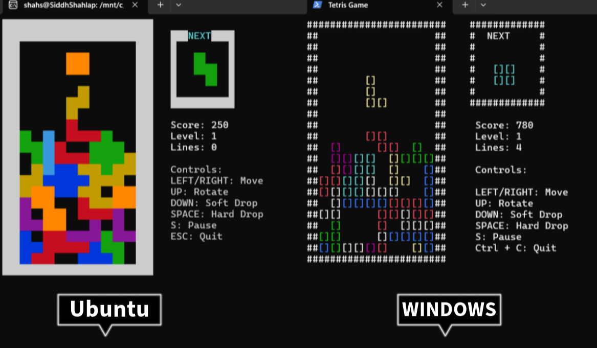

# 🎮 Tetris Game in C++
 
 Welcome to the **Tetris Game** built in C++! 🧩 This is a **console-based** implementation of the classic **Tetris** game. The goal is to manipulate falling blocks (tetrominoes) to form complete rows, which then disappear, earning you points! 🏆
 
 ---
 ## 🚀 Features
 - 🎲 **Classic Gameplay** –  All 7 Tetromino pieces with authentic movement.
 - 🎨 **Colorful UI** - Vibrant NCurses-based interface.
 - 🎛 **Keyboard Controls** – Smooth movement and rotation handling.
 - 🔮 **Next Piece Preview** - See what's coming next
 - 🏅 **High Scores** - Top 5 scores saved persistently
 - 📈 **Score Tracking** – Earn points for clearing lines.
 - 🔊 **Sound Effects** - Audio feedback for game events.
 - ⏳ **Dynamic Gravity** - Realistic physics for floating blocks
 
 ---
 ## 📸 Screenshots
 📌 *Example of game running in the terminal:*  
 
 
 
 ---
 ## 🛠 Installation & Setup
 Follow these steps to clone and run the **Tetris Game** on your local machine:
 
 ### 🔽 Clone the Repository
 ```bash
 git clone https://github.com/Siddhcreator-1706/Tetris.git
 cd Tetris
 ```
 
 ### 📦 Install Dependencies
 If you want **sound support**, install **FFmpeg** on Linux:
 ```bash
 sudo apt update
 sudo apt install ffmpeg libasound2-dev
 ```
 
 ### ⚙️ Build and Run
 Ensure you have a C++ compiler installed (e.g., `g++` for Linux).
 
 #### 🪟 On Windows:
 ```bash
 g++  Tetris.cpp  -o Tetris
 ./Tetris
 ```

 #### 🐧 On Linux:
 ```bash
 g++ -o Tetris Tetris.cpp -lncurses
 ./Tetris
 ```
 
 ---
 ## 🎮 Gameplay Instructions
 ### 🎯 Objective:
 - Arrange falling **tetrominoes** to form **complete horizontal rows**.
 - When a row is filled, it **disappears** and grants **points**.
 - The game speeds up over time, increasing difficulty.
 - Game ends when the tetrominoes reach the **top of the screen**.
 
 ### 🎛 Controls:
 | Key  | Action |
 |------|--------|
 | ⬅️ Left Arrow  | Move piece left |
 | ➡️ Right Arrow | Move piece right |
 | ⬆️ Up Arrow    | Rotate piece |
 | ⬇️ Down Arrow  | Speed up fall |
 | Spacebar       | Hard drop |
 | S             | Pause the game |
 | Ctrl + C  or Esc       | Quit the game |
  
 ---
 ## 🏆 Scoring System
 - **1 Line Cleared** ➝ `100` Points
 - **2 Lines Cleared** ➝ `300` Points
 - **3 Lines Cleared** ➝ `500` Points
 - **4 Lines Cleared (Tetris!)** ➝ `800` Points 🎉
 
 ---
 ## 📊 Data Structures
 
 ### 1. Game Board
 - **Structure**: 2D Vector (`vector<vector<int>>`)
 - **Purpose**: Represents the 22×12 game grid
 - **Details**:
   - Uses integer codes (0=empty, 1-7=pieces, 8=walls)
   - Enables O(1) access for collision detection
   - Borders are pre-filled with wall values
 
 ### 2. Tetromino Storage
 - **Structure**: Array of wide strings (`wstring[7]`)
 - **Purpose**: Encodes all 7 tetromino shapes
 - **Details**:
   - Each shape stored in 4×4 format (16 chars)
   - '.' = empty, 'X' = block
   - Rotation handled mathematically
 
 ### 3. High Score System
 - **Structure**: Vector of structs (`vector<HighScore>`)
 - **Purpose**: Manage player records
 - **Details**:
   - Persisted to "Score.txt"
   - Contains name/score pairs
   - Sorted descending by score
 
 ## OOP Concepts
 
 ### 1. Encapsulation
 - The `Tetris` class encapsulates:
   - Game state (field, score, level)
   - Game logic (movement, rotation)
   - Rendering methods
 - All data members are private
 
 ### 2. Abstraction
 - Public methods expose simple interface:
   - `ProcessInput()`
   - `Update()`
   - `Draw()`
 - Complex internals hidden:
   - Rotation calculations
   - Collision detection
   - Line clearing logic
 
 ### 3. Modular Design
 - Separated responsibilities:
   - Game mechanics (Tetris class)
   - UI/Display (NCurses)
   - Audio (system calls)
   - Score management
 
 ### 4. Resource Management
 - RAII principles:
   - NCurses initialization/cleanup
   - File handling for scores
   - Automatic vector memory management
 
 ## Design Patterns
 
 1. **Game Loop Pattern**
    - Clear `Update()`/`Draw()` separation
    - Fixed timestep for piece falling
 
 2. **State Pattern**
    - Handles game states:
      - Playing
      - Paused
      - Game Over
 
 3. **Observer Pattern**
    - Score updates trigger:
      - Level progression
      - Speed changes
      - Audio feedback
 
 ## 🛠 Contributing
 We welcome contributions! Follow these steps to contribute:
 
 1. **Fork the repository**
 2. **Create a new branch**
    ```bash
    git checkout -b feature-branch
    ```
 3. **Make changes & commit**
    ```bash
    git commit -m "Add new feature"
    ```
 4. **Push your changes**
    ```bash
    git push origin feature-branch
    ```
 5. **Create a pull request** 📩
 
 ---
 ## 🤝 Contributors
 - [Siddhcreator-1706](https://github.com/Siddhcreator-1706)
 - [Tanish-30-08-2006](https://github.com/Tanish-30-08-2006)
 - [Keval-tech](https://github.com/Keval-tech)
 - [khushis02](https://github.com/khushis02)
 ---